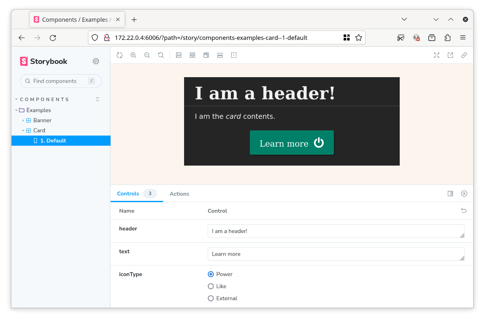

# Twig Storybook


Twig Storybook is a Composer package that enhances the Twig templating language by introducing two new Twig tags: `stories` and `story`. With Twig Storybook, you can easily create and manage Storybook stories directly in your Twig templates, making it a powerful tool for documenting and showcasing your frontend components.

## Table of Contents

- [Installation](#installation)
- [Usage](#usage)
- [Contributing](#contributing)
- [License](#license)

## Installation

You can install Twig Storybook via Composer:

```bash
composer require e0ipso/twig-storybook
```

## Usage

### With Drupal
You don't need to use this package directly, use the [Storybook](https://www.drupal.org/project/storybook)
drupal module instead. This library is compatible with Drupal 10, and later.

### Adding Twig Tags

After installing the package, you need to register the Twig tags in your Twig environment. Here's how you can do it:

```php
use Twig\Environment;
use Twig\Loader\FilesystemLoader;
use TwigStorybook\Twig\StorybookExtension;

// Initialize the Twig environment
$loader = new FilesystemLoader('path/to/your/templates');
$twig = new Environment($loader);

// Register the Storybook extension
$twig->addExtension(new \TwigStorybook\Twig\TwigExtension());
```

### Creating Stories

Once the Twig Storybook extension is registered, you can start creating stories within your Twig templates. We recommend
writing the stories in a file with name `<file-name>.stories.twig`.

- Use the `` tag to define a group of stories.
- Use the `` tag to define an individual story.

Here's an example:

```twig


  
    
      
        <p>I am the <em>card</em> contents.</p>
        
      
    
  


```

This will render as:



### Storybook setup

Install Storybook as usual:

```console
# Make use of modern versions of yarn.
yarn set version berry
# Avoid pnp.
echo 'nodeLinker: node-modules' >> .yarnrc.yml
# Install and configure stock Storybook.
yarn dlx sb init --builder webpack5 --type server
```

Then update `.storybook/main.js` to scan for stories where your application stores them.

### Compiling Twig stories into JSON

The Storybook application will does not understand stories in Twig format. It will fail to render them. You need to
compile them into a `*.stories.json`. To do so, you can leverage the
`StoryRenderer::generateStoriesJsonFile($template_path, $url)` method. Where the `$template_path` is the location of the
`*.stories.twig` template, and the `$url` is the base URL in your application that will render the story.
Storybook will make a request to `"$url . '/' . $hash"`, so make sure your application handles that route (see below).

The [Drupal module implementation](https://www.drupal.org/project/storybook) includes a console command to find all
`*.stories.twig` and compile them into `*.stories.json`.
[See the implementation](https://git.drupalcode.org/project/storybook/-/blob/1.x/src/Drush/Commands/StorybookCommands.php).

### Rendering Stories

To render the Storybook stories, you can use the `StoryRenderer` service. Every framework handles routes differently,
but we recommend using the story renderer inside your controller.

```php
  public function renderStoryControllerHandler(string $hash, Request $request): array {
    $data = $this->storyRenderer->renderStory($hash, $request);
    return new Response($data);
  }
```

To use this service, wire the services to the container. The Twig Storybook Drupal module does it like this:

```yaml
services:
  logger.channel.twig_storybook:
    parent: logger.channel_base
    arguments: ['twig_storybook']

  TwigStorybook\Service\StoryCollector: {}
  TwigStorybook\Service\StoryRenderer:
    arguments:
      - '@TwigStorybook\Service\StoryCollector'
      - '@logger.channel.twig_storybook'
      - '%app.root%'
    calls:
      - ['setTwigEnvironment', ['@twig']]

  TwigStorybook\Twig\TwigExtension:
    arguments:
      - '@TwigStorybook\Service\StoryCollector'
      - '%app.root%'
    tags:
      - { name: twig.extension }
```

## Contributing

We welcome contributions from the community. If you want to contribute to Twig Storybook, please follow these guidelines:

1. Fork the repository.
2. Create a new branch for your feature or bug fix.
3. Make your changes and ensure all tests pass.
4. Submit a pull request with a clear description of your changes.

Make sure to follow the [code of conduct](CODE_OF_CONDUCT.md) when interacting with this community.
## License

Twig Storybook is open-source software licensed under the [GPL-2 License](LICENSE).
